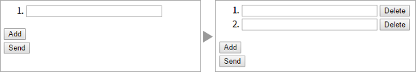

# jquery.add-input-area

[](https://www.npmjs.com/package/jquery.add-input-area)
[](https://travis-ci.org/sutara79/jquery.add-input-area)
[](https://coveralls.io/github/sutara79/jquery.add-input-area?branch=master)
[](https://david-dm.org/sutara79/jquery.add-input-area)

jQuery plugin to add or delete form fields.




## Demo
https://sutara79.github.io/jquery.add-input-area/


## Install
- [GitHub](https://github.com/sutara79/jquery.add-input-area): Clone or download.
- [npm](https://www.npmjs.com/package/jquery.add-input-area): `npm i jquery.add-input-area`
- CDN [(jsDelivr)](https://www.jsdelivr.com/):
    - [jquery.add-input-area.min.js (v4.9.2)](https://cdn.jsdelivr.net/npm/jquery.add-input-area@4.9.2/dist/jquery.add-input-area.min.js)


## Usage

###### HTML
```html
<ol id="list"><!-- "id" attribute is required -->
  <li class="list_var"><!-- .(id)_var -->
    <input type="text" name="list_0" id="list_0">
    <button class="list_del">Delete</button><!-- .(id)_del -->
  </li>
</ol>
<input type="button" value="Add" class="list_add"><!-- .(id)_add -->

<script src="https://code.jquery.com/jquery-3.2.1.min.js"></script>
<script src="jquery.add-input-area.min.js"></script>
```

###### JavaScript
```javascript
$('#list').addInputArea();
```

## Naming convention
- CSS class for the wrapper of form fields: `.(id)_var`
- CSS class for del-button: `.(id)_del`
- CSS class for add-button: `.(id)_add`

You can change these rules above by options. (`area_var`, `btn_add`, `btn_del`)


- Form field: `(a text)_0`

If you follow this rule, "name", "id" and "for" attribute are numbered automatically.

```html
(default)
<input type="text" name="foo_0">

(add)
<input type="text" name="foo_1">
<input type="text" name="foo_2">
<input type="text" name="foo_3">
```

You can use original naming convention by setting custom data attribute, "data-name-format" or "data-id-format".

``` html
(default)
<input type="text" data-name-format="foo_%d_bar" name="foo_0_bar">

(add)
<input type="text" data-name-format="foo_%d_bar" name="foo_1_bar">
<input type="text" data-name-format="foo_%d_bar" name="foo_2_bar">
```

```html
(default)
<input type="text" data-name-format="data[posts][mail][%d]" name="data[posts][mail][0]">

(add)
<input type="text" data-name-format="data[posts][mail][%d]" name="data[posts][mail][1]">
<input type="text" data-name-format="data[posts][mail][%d]" name="data[posts][mail][2]">
```

- See [How to use on CakePHP (jquery.add-input-area v4.7.1, CakePHP v2.3.8)](http://code.runnable.com/U7vCAlCwvQZzFZBO/how-to-use-jquery-add-input-area-on-cakephp)


## Options
|Name                                                                     |Type    |Default    |Description                                   |
|-------------------------------------------------------------------------|--------|-----------|----------------------------------------------|
|[area_var](https://sutara79.github.io/jquery.add-input-area/#index_02)   |string  |'.(id)_var'|CSS class for the wrapper of form fields.     |
|[btn_add](https://sutara79.github.io/jquery.add-input-area/#index_02)    |string  |'.(id)_add'|CSS class for add button.                     |
|[btn_del](https://sutara79.github.io/jquery.add-input-area/#index_02)    |string  |'.(id)_del'|CSS class for delete button.                  |
|[area\_del](https://sutara79.github.io/jquery.add-input-area/#index_04)  |string  |(btn_del)  |CSS class for wrapper of delete button.       |
|[after_add](https://sutara79.github.io/jquery.add-input-area/#index_10)  |function|null       |A callback function to be called after adding.|
|[clone_event](https://sutara79.github.io/jquery.add-input-area/#index_11)|boolean |true       |If event will be copied or not.               |
|[maximum](https://sutara79.github.io/jquery.add-input-area/#index_05)    |number  |0          |Max number of wrapper of form fields. "0" means unlimited.|


## Compatibility
- jQuery: >=3.0.0 ([because of XSS vulnerability](https://nodesecurity.io/advisories/jquery_xss))
- Browser: Chrome58, Firefox53, IE11, Edge14


## License
[MIT](https://www.opensource.org/licenses/mit-license.php)


## Author
[Yuusaku Miyazaki](http://d.hatena.ne.jp/sutara_lumpur/20120509/1336556562)
( <toumin.m7@gmail.com> )
